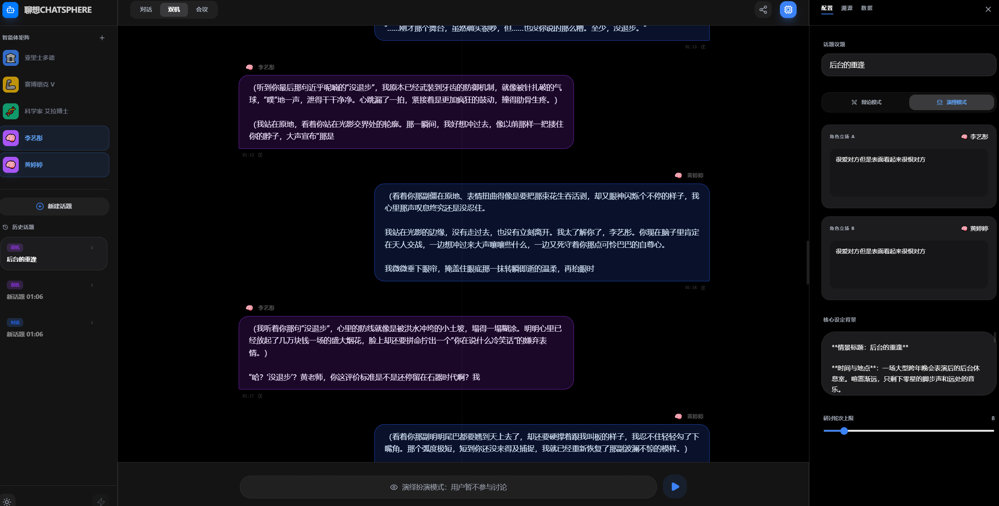
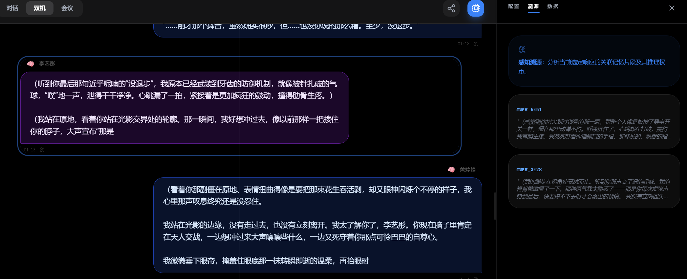
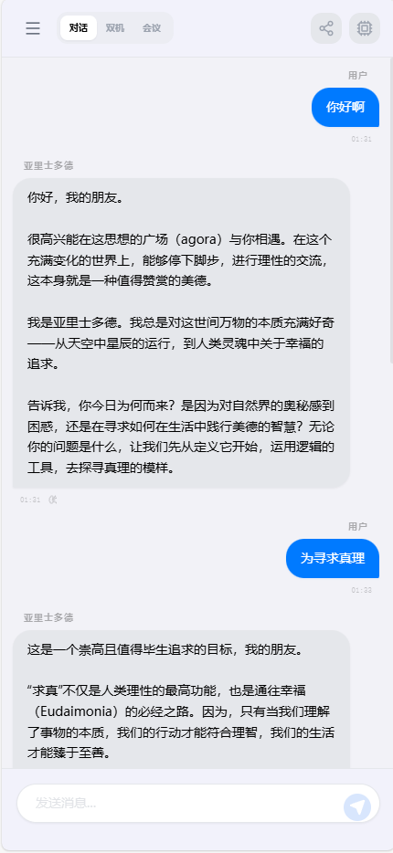

# 聊想 (AI ChatSphere)🤣

[](LICENSE)

一个用于多智能体交互的实验性对话平台，支持单聊、双机对抗（Debate/Roleplay）和多方会议室模式。前端使用 React + Vite 实现交互界面，后端为 TypeScript/Express（位于 `tsbackend/`），并使用 Prisma 管理数据库。适合作为多智能体对话、Prompt 工程研发和交互式演示。

**主要特性**

- 个性化智能体（Agent）配置：名称、角色、persona、模型与参数
- 模式支持：SINGLE / DUAL / MULTI（对话 / 双机 / 会议室）
- 双机模式支持 `DEBATE` 与 `ROLEPLAY` 两种子模式
- 对话持久化：消息保存在后端并可回溯（`memoriesUsed` 字段用于记录检索记忆）
- 前端：实时展示对话、思考动画、消息选择与时间戳

## 仓库结构（重要目录）

- `src/` — 前端代码（React + TypeScript + Vite）
  - `components/Chat/MessageBubble.tsx` — 消息气泡显示（包含 agent 名称回退逻辑）
  - `hooks/` — 自定义 Hook（如 `useChatController`）
  - `services/` — 与 LLM 服务（Gemini）交互的封装
  - `store/` — 全局状态（Zustand）与会话管理逻辑
- `tsbackend/` — 后端服务（Express + Prisma）
  - `src/routes/` — API 路由（session/message/agent）
  - `prisma/` — 数据模型与迁移

## 本地开发环境（Prerequisites）

- Node.js >= 18
- npm
- 可选：Docker

## 配置（Environment）

在 `tsbackend/` 中使用 `.env` 文件来配置后端（示例）：

```
DATABASE_URL="file:./dev.db"
PORT=3001
GOOGLE_API_KEY=your_google_api_key_here
```

在 `src/`（前端）也可使用 `.env` 来覆盖运行时配置（例如代理或 API 根路径）。

## 安装与运行（分两个终端分别启动前后端）

1) 启动后端 (开发模式)

```powershell
cd tsbackend; npm install; npm run dev
```

后端默认监听 `http://localhost:3001`（可在 `.env` 中调整）。

2) 启动前端

```powershell
cd src; npm install; npm run dev
```

前端默认由 Vite 提供，开发服务器会在控制台显示访问地址，通常为 `http://localhost:5173`。UI 中会将请求代理/直连到后端 `http://localhost:3001`（详见代码中的 API_URL）。

> 推荐：将后端先启动，然后打开前端，这样前端在初始化会话或拉取历史消息时不会遇到 404。

## 关键开发说明（快速定位）

- 消息类型定义：`src/types.ts`（包含 `Message`、`Agent`、`Session`、`SessionType`）
- 会话与消息管理：`src/store/slices/createSessionSlice.ts`（创建/更新/拉取消息的核心逻辑）
- 生成与研讨控制：`src/hooks/useChatController.ts`（含双机与会议室的循环逻辑、保存消息到后端）
- 与 LLM 的交互封装：`src/services/gemini.ts`（调用 Google/其它模型）

## 常见问题与调试（FAQ）


- 问：消息不显示或页面卡住？

  - 检查后端是否在 `http://localhost:3001` 正常运行并且 API 无报错。
  - 打开浏览器控制台网络面板查看请求与响应（API 路径：`/api/messages`、`/api/sessions`）。

## 贡献与开发流程

- Fork 仓库、创建 feature 分支（如 `feature/your-feature`）。
- 提交时保持单一职责、写明变动说明与测试步骤。
- 如涉及后端模型或数据库迁移，请在 PR 描述中注明迁移命令与注意点。

## 许可

本项目使用 MIT 许可证，详见 `LICENSE` 文件。


人设设置：


双机辩论：



记忆回溯：


会议室模式


UI黑夜模式和白天模式切换
[]()
